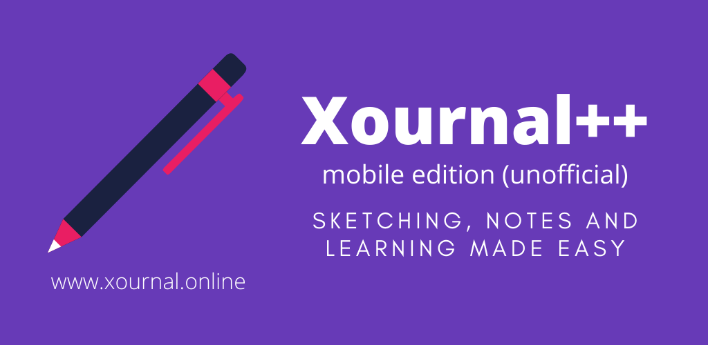

#  Xournal++ - mobile edition (unofficial)

A port of the main features of Xournal++ to various Flutter platforms like Android, iOS and the Web.



# Try it out

***Mission completed:** We can now render strokes, images and text!. We thereby support the full `.xopp` file format.* :tada:

*Please note: stroke support is incredibly bad. There are lots of errors thrown.*

https://xournal.online/

Alternatively, you can download pre-build binaries for **Linux** and **Android** from the GitLab pipeline.

### Visible parts already working:

- [x] Read the document title
- [x] Read and display the number of pages
- [x] Create thumbnails of the pages for the navigation bar
- [x] Smooth fade in after thumbnail rendering
- [x] Render images on the canvas
- [x] Render text on the canvas
- [x] Strokes (lots of errors remaining)

## Getting started

Get your information about the `.xopp` file format at http://www-math.mit.edu/~auroux/software/xournal/manual.html#file-format .

Install Flutter first. See [flutter.dev](https://flutter.dev/docs/get-started/install) for more details.
```
# Run Flutter doctor to check whether the installation was successful
flutter doctor
```

Connect any Android or iOS device.

```
git clone https://gitlab.com/TheOneWithTheBraid/xournalpp_mobile.git
cd xournalpp_mobile
flutter run
```

If you want to test for the web, please run:

```
flutter channel beta
flutter upgrade
flutter config --enable-web
flutter run -d web
```

If you want to test for Linux or macOS, please run:

```
flutter channel master
flutter upgrade
flutter config --enable-linux-desktop # or --enable-macos-desktop
flutter run -d linux # or macos
```

## Colors

Our primary color is the Material DeepPurple. I simply prefer a colorful application over an old-fashioned gray GTK+ application.

`#673ab7` / `rgb(103, 58, 183)` / `CMYK(44%, 68%, 0%, 28%)` / `hsl(261°, 51%, 48%)`

The accent color is Material Pink.

`#e91e63` / `rgb(233, 30, 99)` / `CMYK(0%, 87%, 58%, 9%)`/ `hsl(340°, 81%, 51%)`

# Misc

This software is powered by the education software [TestApp](https://testapp.schule) - **Learning. Easily.**

[](https://testapp.schule)

## Legal notes

This project is licensed under the terms and conditions of the EUPL-1.2 found in [LICENCE](LICENCE).